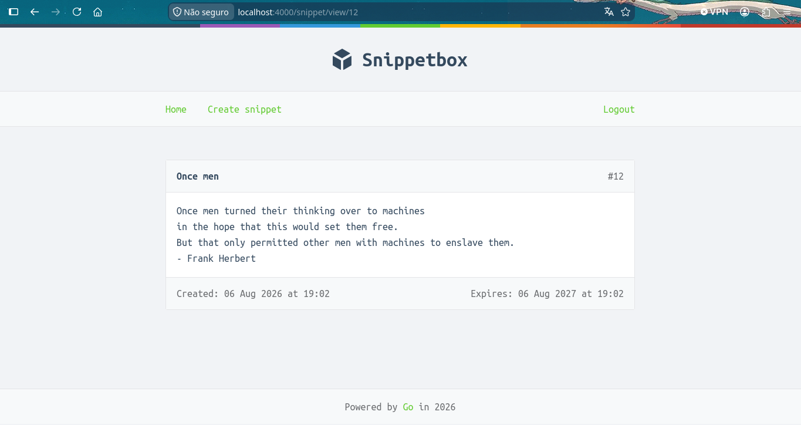
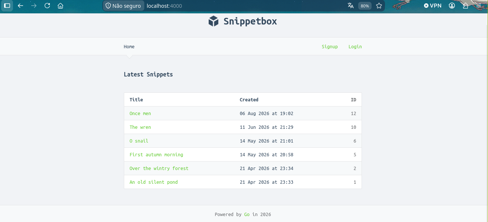
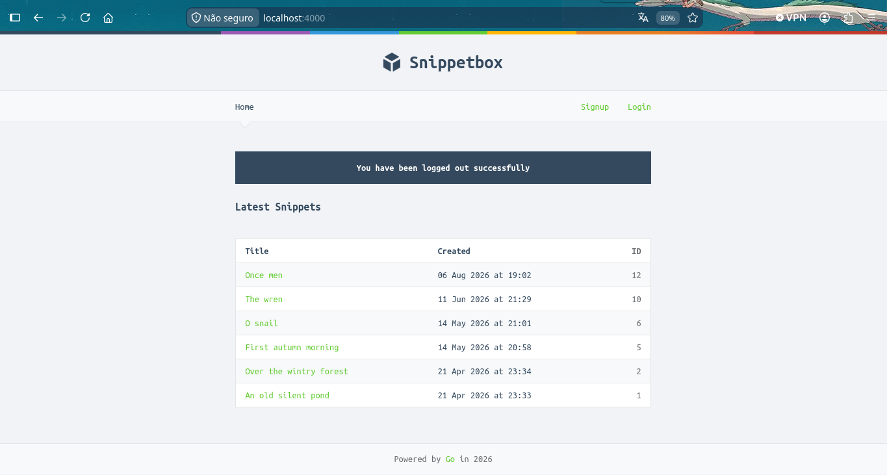
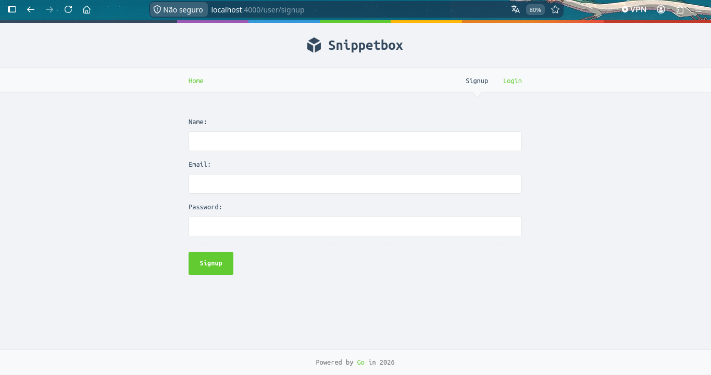

# Snippetbox

Snippetbox is a fullstack application made with the golangs default net/http library and standard html,css and javascript. The web application uses MySQL as its database. Needing it to have it installed and with the tables created beforehand in order of it to work.

Testing the application has made using the testing package, the testing was made on the routes, the handlers, the middleware and even on the database.

The application allows the user to create an account post the snippets of any author that they would like, like the above:
*Quote from the first book of Dune made by the reverend mother of the Bene Gesserit*

## Screenshots
Here is a list of screenshots of the application, the fist quotes were inserted on the application prior to a user signup feature was implemented.

### Main Page
The main page of the application when no user is logged.

### Logout 
When you logout of your account a message from scs package appears informing you that.

### Signup Page 
The layout of the signup page.

## To do 
- [ ] Use Docker and Docker Compose for our MySQL database connection, instead of needing to have MySQL installed on our machine.
- [ ] Implement SQL Migrations with Goose.
- [ ] Using enviroment variables for db connection.
- [ ] Adapt the database testing to reflect the migrations.

## References 
https://pkg.go.dev/net/http

https://lets-go.alexedwards.net/

https://github.com/alexedwards/scs
